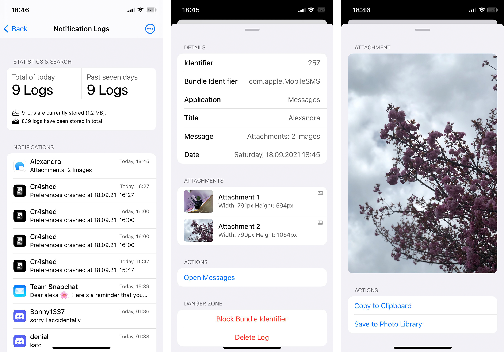

# Vē 💌
Natively integrated notification logger

## Preview

## Installation
1. Add this repository to your package manager: `TBD`
2. Install Vē

## Compatibility
iPhone, iPad and iPod running iOS/iPadOS 13 or later

## Compiling
  - [Theos](https://theos.dev/) is required to compile the project
  - You may want to edit the root `Makefile` to use your Theos SDK and toolchain

## License
[MIT](https://github.com/Traurige/Ve/blob/main/LICENSE)

## Credits
  - Idea, Icons And Banner
    - [74k1_](https://twitter.com/74k1_)
  - Implementing The Main Specifier
    - [pixelomer](https://twitter.com/pixelomer)
  - Taught Me How To Use Specifiers
    - [LacertosusDeus](https://twitter.com/LacertosusDeus), [D_Gh0st](https://twitter.com/d_gh0st), [MrGcGamer](https://twitter.com/MrGcGamer)
  - Preventing Duplicates
    - [AnthoPak](https://twitter.com/AnthoPak)
  - Duo Twitter Cell
    - [arm64e](https://twitter.com/arm64e), [MrGcGamer](https://twitter.com/MrGcGamer)
